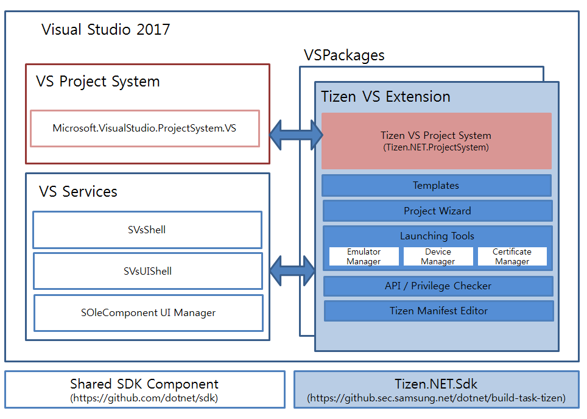

## Welcome to the Visual Studio Tools for Tizen ###

The Visual Studio Tools for Tizen provides Visual Studio extension that enables developing Tizen .NET applications.

### Architecture on Visual Studio ###

---

### Prerequisite before starting ###
- Require [Visual Studio 2017](https://www.visualstudio.com/ko/downloads/)
   - Works with all of Visual Studio editions, including Community version
   - Alphabetic Windows user account name is recommended. (NO GLOBAL CHARACTER SET OR WHITE SPACE)
- Require Intel [HAXM](https://software.intel.com/en-us/android/articles/installation-instructions-for-intel-hardware-accelerated-execution-manager-windows) for Emulator
   - Hyper-V should be disabled
- Add Tizen Device API Myget Server address for using Tizen Build Task
   - https://tizen.myget.org/F/dotnet/api/v3/index.json

### Restrictions ###
- Xamarin.forms projects cannot be built by CLI tool

### How to download Tizen.MIDebugPackage.visx to build vs-tools ###
* Download latest version: http://10.113.138.168/packages/vsext/vsix/Tizen.MIDebugPackage.vsix

### How to download Released version ###
* Download latest version: http://10.113.138.168/packages/vsext/

### How to install ###
- refer [How to Install](docs/how-to-install.md)

### How to build this project ###
* Clone the sources: git clone https://github.sec.samsung.net/dotnet/vs-tools-cps.git
* Build https://github.sec.samsung.net/dotnet/miengine and put result vsix to the root of the project
* Open src/Tizen.NET.sln in Visual Studio
* Debug -> Start Debugging (or F5) to to build, deploy, and start debugging the Experimental Instance of Visual Studio.
Build error on Windows 10 VS 15.8.* 'Unable to copy file ... . Access to the path is denied.'
Need to make directories C:\Program Files(x86)\Tizen and C:\Program Files(x86)\Microsoft Visual Studio\2017\Community\MSBuild\Tizen and setup the full access(read, write, modify) for current user.
* To install vs-tools-cps vsix plugin from sources, do not forget to delete the previous version and reinstall vsix miengine.

### Folder Descrition in repository ###
* Tizen.VisualStudio.VsixSetup : Vsix Project
* Tizen.VisualStudio.Tools : Visual Studio Tools for Tizen extension code
* Tizen.VisualStudio.ProjectSystem.VS : Project System for Tizen Project
* Tizen.VisualStudio.ProjectSystem : Project System base library
* Template : Template lists
* Profiler : Tizen profiler

---

### Document List ###

#### Usage Guide ####
   1. [Install Guide](docs/how-to-install.md)
   2. [Tizen Package Creation Guide](docs/packaging/how-to-create-tpk.md) - Guide to build and publish Tizen Applications
   3. [Tizen Project Customization Guide](docs/packaging/how-to-customize-tpk.md) : Guide to include or exclude your libraries / resources in tizen project
   4. [Migration Guide](docs/packaging/how-to-migrate-to-csproj.md) - If you had a tizen project used in preview version, you can migrate for working new tools
   5. Build Guide
      1. [Use Visual Studio](docs/packaging/how-to-build-vs.md)
      2. [Use dotnet cli](docs/packaging/how-to-build-cli.md)

#### Tool Guide ####
   1. [Project Wizard](docs/tools/project-wizard.md) : The Project Wizard is a tool that is used to create a Tizen .NET application project
   2. [Certificate Manager](docs/tools/certificate-manager.md) : The certificates can be created, edited, removed, and set as active in the Certificate Manager. The active certificates are used when packaging your application.
      - [Samsung Certificate Extension](docs/tools/samsung-certificate.md)
   3. [Tizen Manifest Editor](docs/tools/manifest-editor.md) : The Tizen Manifest Editor is a tool that is used to edit Tizen manifest file, called tizen-manifest.xml, which is used to describe the application information
   4. [Emulator Manager](docs/tools/emulator-manager.md) : The Emulator Manager provides emulators to run your application in a virtual environment
   5. [Device Manager](docs/tools/device-manager.md) : The Device Manager is a standalone tool that provides information of connected Tizen devices or emulators for application debugging
   6. [Log Viewer](docs/tools/log-viewer.md) : The Log Viewer helps you debug your application by capturing all the events logged by the platform and your application
   7. [API and Privilege Checker](docs/tools/api-and-privilege-checker.md) : The API Checker tool checks for API and privilege usage violations in the application code. It helps you to identify and fix potential problems in the application code related to API and privilege use
   8. [Profiler](docs/tools/profiler-user-manual.md) (Preview)
   9. [XAML Previewer](docs/tools/xaml-previewer.md)
   10. [Memory Profiler](docs/tools/memory-profiler-user-manual.md) (Preview)
