# How to Build Tizen project on Visual Studio Team Service

## Table of contents
- [Prerequisite](#prerequisite)
  - [Install Visual Studio Tools for Tizen](#install-visual-studio-tools-for-tizen)
  - [Create Visual Studio Team Services Accounts & Project](#create-visual-studio-team-services-accounts--project)
  - [Install VSTS extension (from marketplace)](#install-vsts-extension-from-marketplace)
  - [Install VSTS extension (from develop channel)](#install-vsts-extension-from-develop-channel)
- [Visual Stuido](#visual-stuido)
  - [Create Tizen Project](#create-tizen-project)
  - [Develop your application](#develop-your-application)
  - [Push your code to VSTS](#push-your-code-to-vsts)
- [Visual Studio Team Service](#visual-studio-team-service)
  - [Install(or update) VSTS extension](#installor-update-vsts-extension)
  - [Create VSTS Project & Push source code](#create-vsts-project--push-source-code)
  - [Write Build definition](#write-build-definition)
- [Tip](#tip)
  - [Copy & Publish Artifact](#copy--publish-artifact)

## Prerequisite
### Install Visual Studio Tools for Tizen
- public site : https://marketplace.visualstudio.com/items?itemName=vs-publisher-1484655.VisualStudioToolsforTizen
  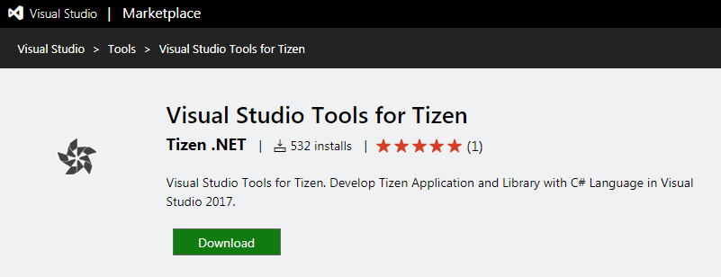

### Create Visual Studio Team Services Accounts & Project
- Create Microsoft Accounts
- Create Visual Studio Team Services Accounts (https://www.visualstudio.com/team-services/)
- Create New Project
- Push Tizen Code to VSTS

### Install VSTS extension (from marketplace)
- Go to marketplace & search tizen (https://marketplace.visualstudio.com/items?itemName=tizen.d45d5e83-ee47-4ffc-abe7-844bcc1640a6)
- Uninstall old version of "Tizen Signing Tool" extension if your team space already have it.(This job will take 10~20sec. DO NOTHING while the uninstallation is progressed!)
  - Visit `https://[YOURTEAMSPACE].visualstudio.com/_admin`
  - Click "Extensions" menu.
  - Click the Icon '...' to uninstall extension 
    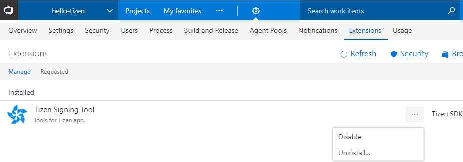

- Install new version of "Tizen Signing Tool"
  - Go to develop channel (https://marketplace.visualstudio.com/items?itemName=tizen-sdk.d45d5e83-ee47-4ffc-abe7-844bcc1640a6) and check version info
    

  - Click the Install button, select team service account and confirm.
    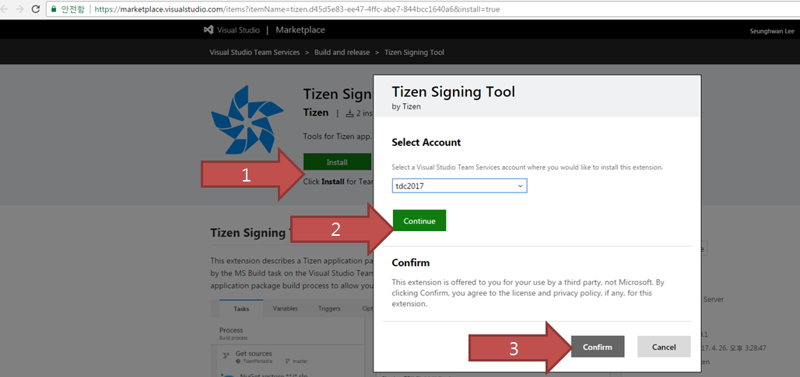

  - Check the Installed extension
    - Visit `https://[YOUR TEAM SPACE].visualstudio.com/_admin`.
    - Click "Extensions" menu.
      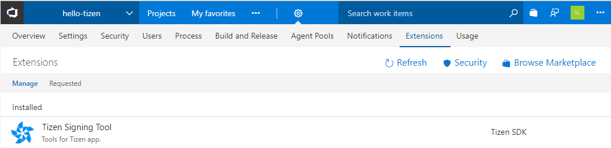
 
## Visual Stuido
### Create Tizen Project
- File > Project > Tizen > Blank App (Tizen.NUI)
  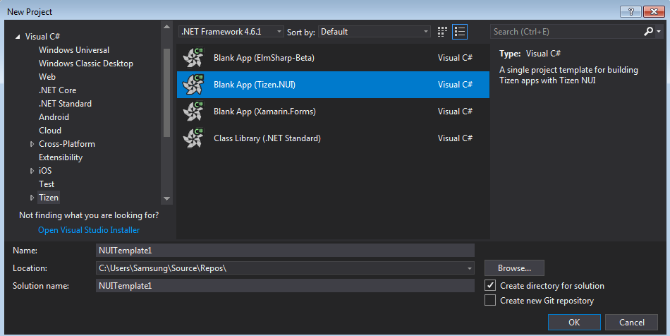

### Develop your application
- Build
- Run 
- Debug
- Test 

### Push your code to VSTS
- git commit & push to repository to VSTS team project (more info - https://docs.microsoft.com/en-us/vsts/git/)

## Visual Studio Team Service
### Install(or update) VSTS extension 
  - [Install VSTS extension (from marketplace)](#install-vsts-extension-from-marketplace)

### Create VSTS Project & Push source code
- Click "New Project"  button
  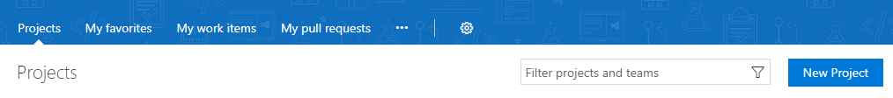

- write project name & push tizen source code 
  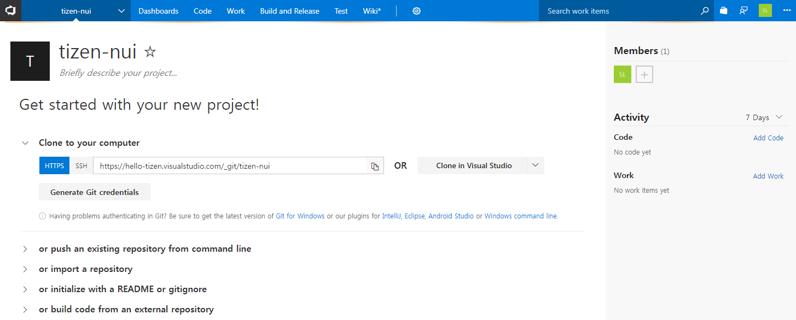
 
 
### Write Build definition
- Create Build definition (Build & Release > Builds > + New )
  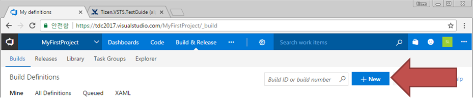

- Click the "Empty process"
  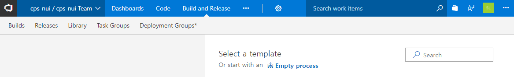

- Write Build definition name & select agent queue
  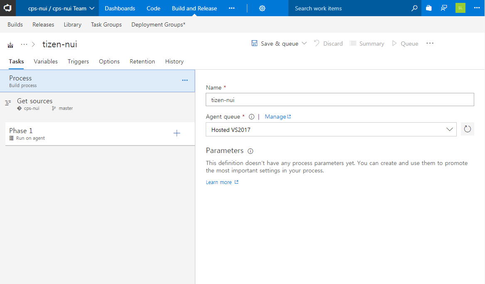

- Select source repository & branch 
  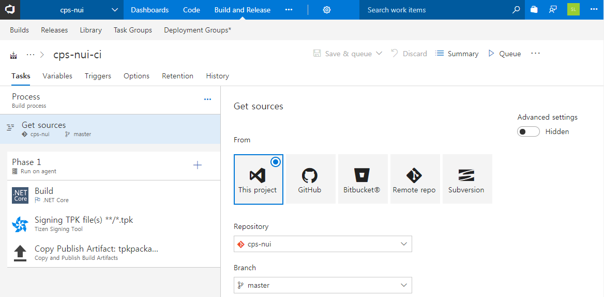

- Click "+" Icon to add task > Add .NET Core Task 
  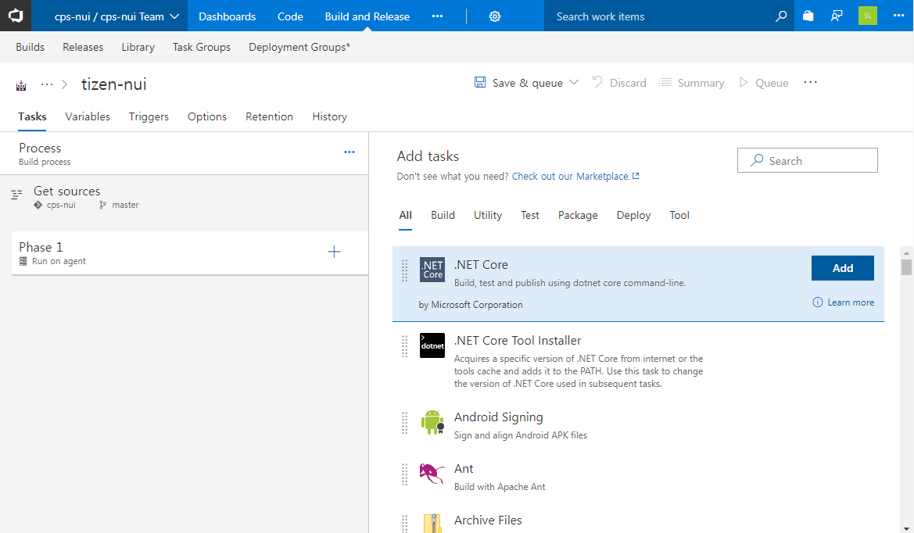

- Select project file to build on Project field (**/*.csproj)
  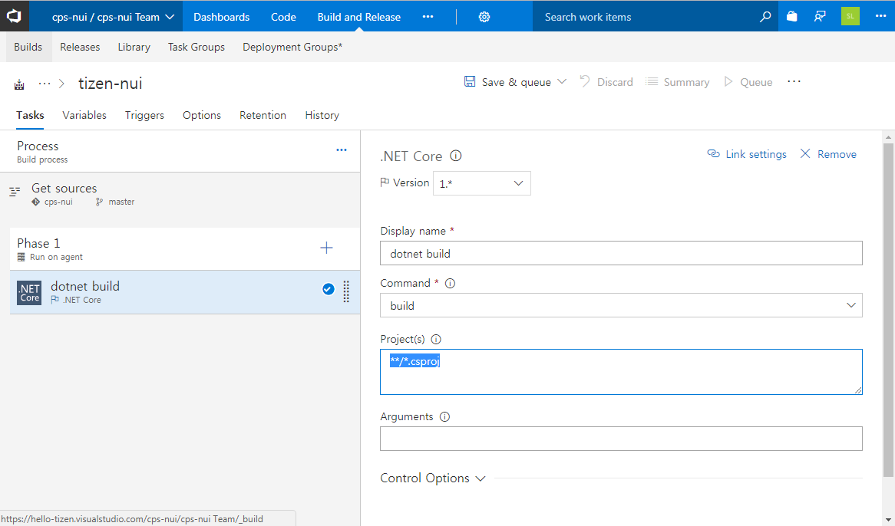

- Click "+" Icon to add task > Add Tizen Signing Tool Task (if you can't see tizen task. please refer Install VSTS extension)
  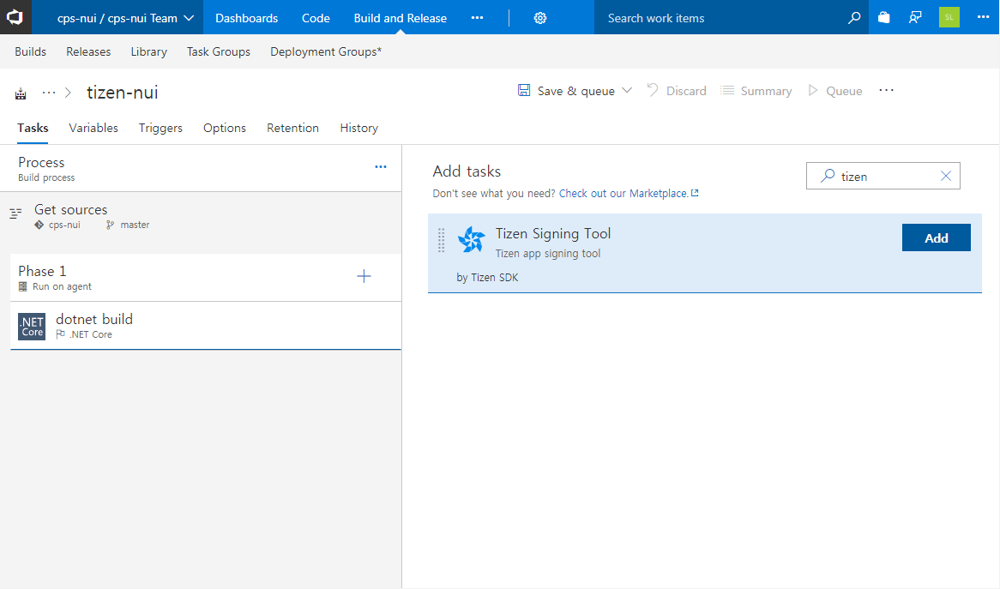

- Select Identifiers > click icon to upload certificate (Author Certificate & Distributor Certificate)
  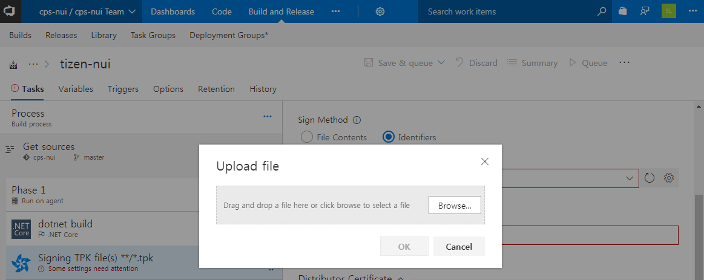
  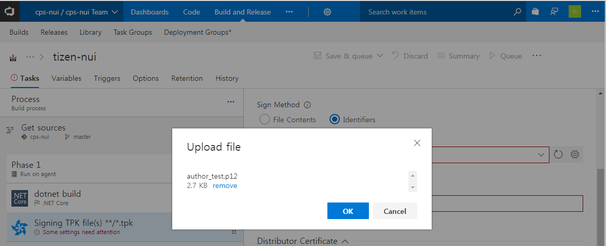

- Variables Tab > add password Key & Value > Click lock icon
  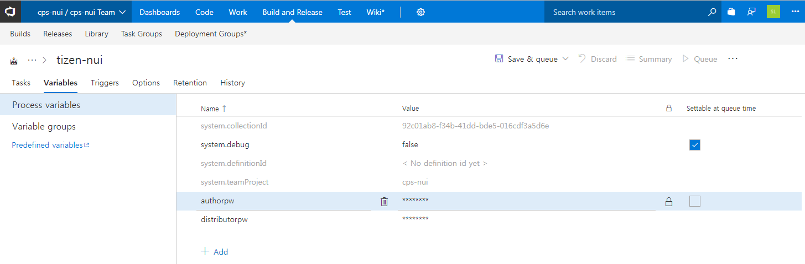

- Tasks Tab Add Password variables 
  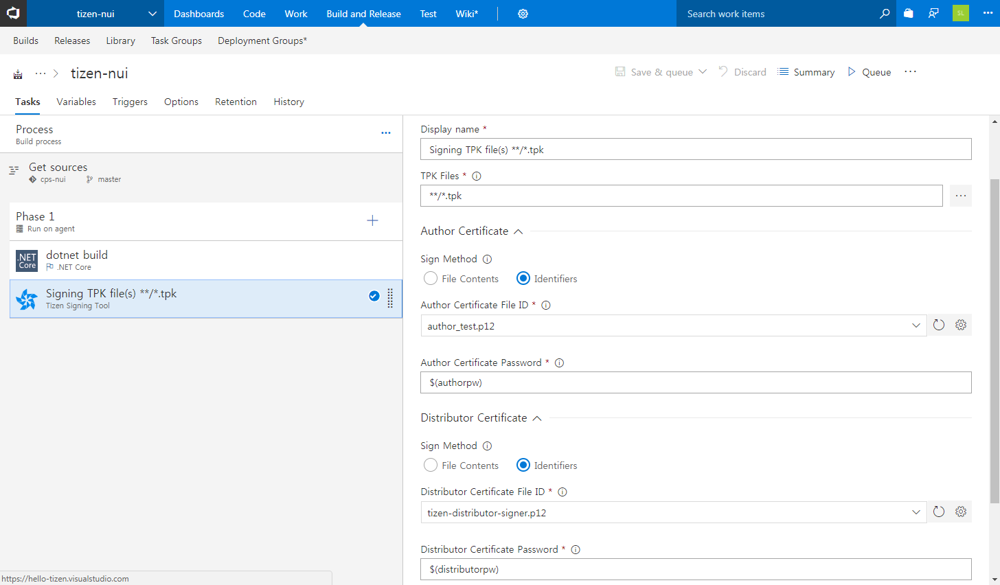

- Click Save & queue > See the build process 
  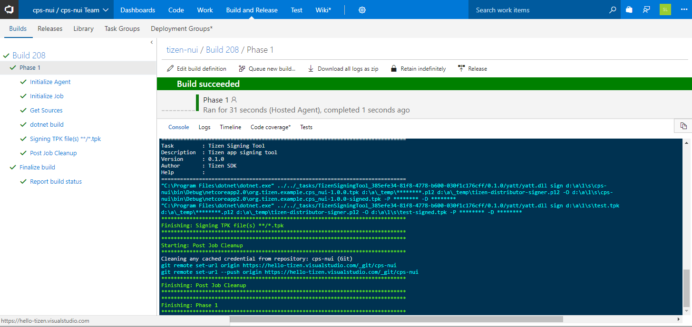
 
## Tip
### Copy & Publish Artifact 
- Add Copy Files Task (https://docs.microsoft.com/en-us/vsts/build-release/tasks/utility/copy-files)
- Set the Contents Field (ex : **/*.tpk)
- Set the Target Folder (ex : tpkresult)
  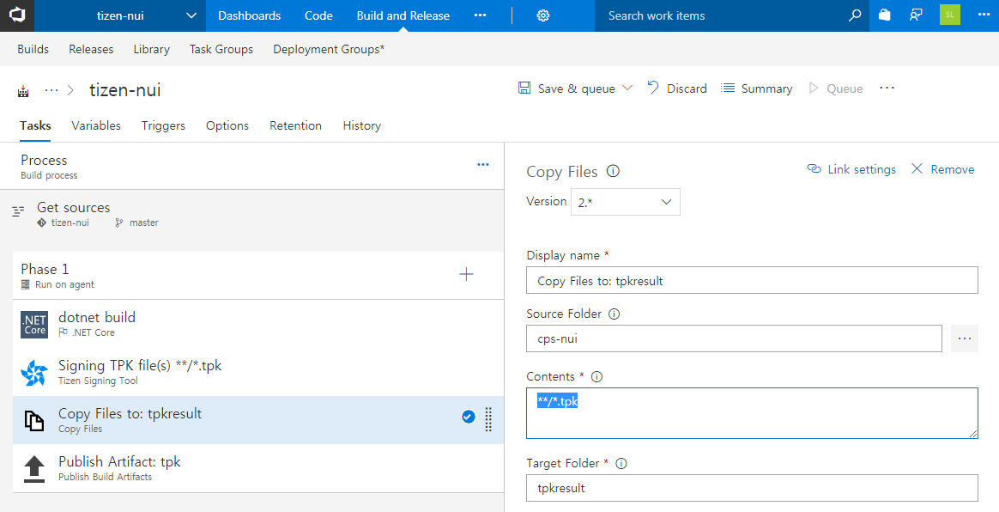

- Add Publish Artififact Task (https://docs.microsoft.com/en-us/vsts/build-release/tasks/utility/publish-build-artifacts)
- Set the Path to publish (ex : tpkresult)
- Set the Artifact name (ex : tpk)
  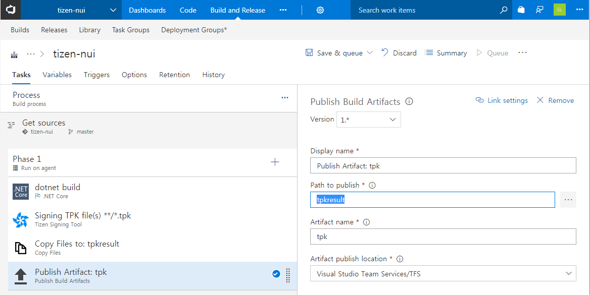

- Save & queue
- Go to Build Result View 
  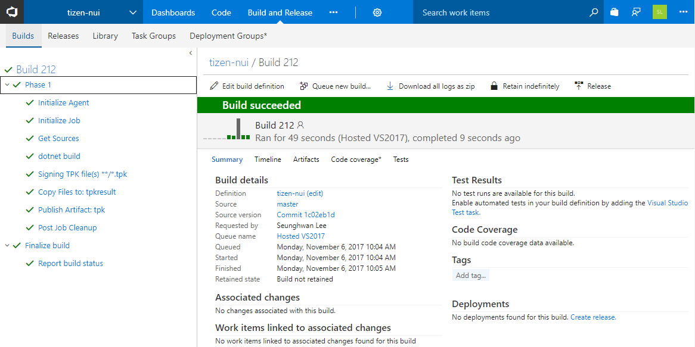

- Click artifact tab & click explore 
  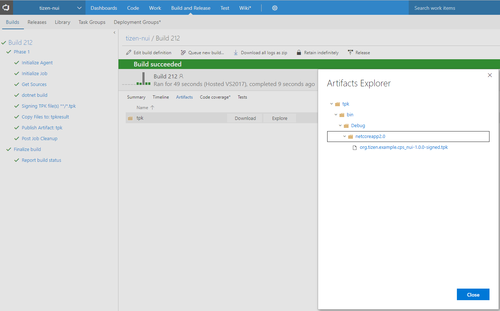
