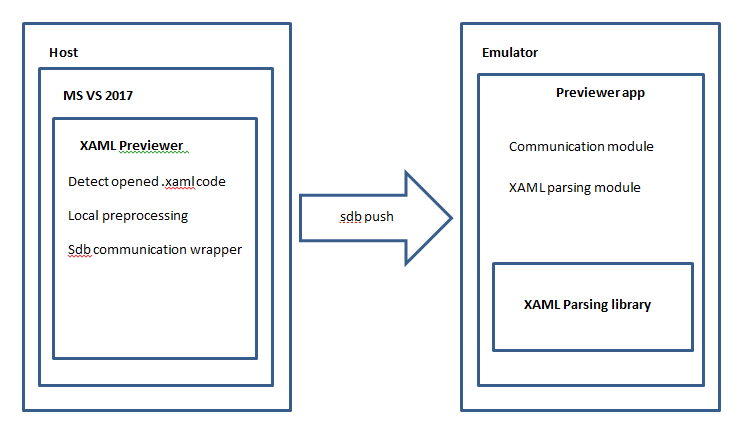
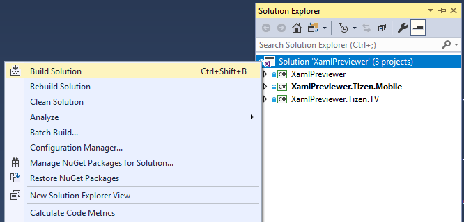
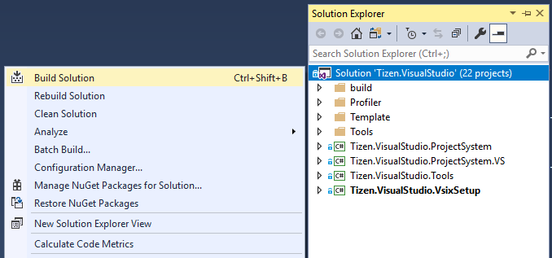
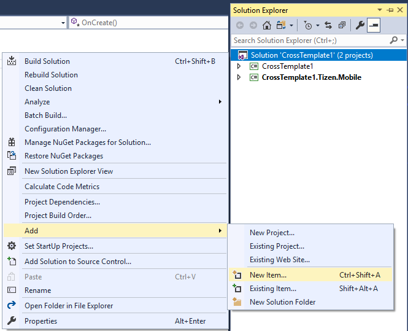
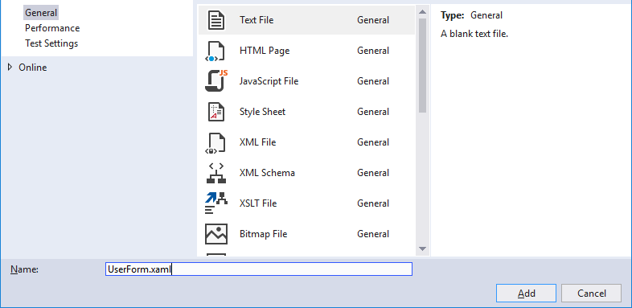
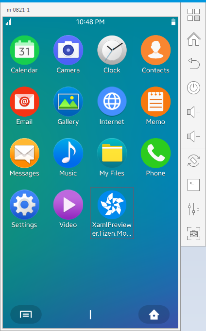
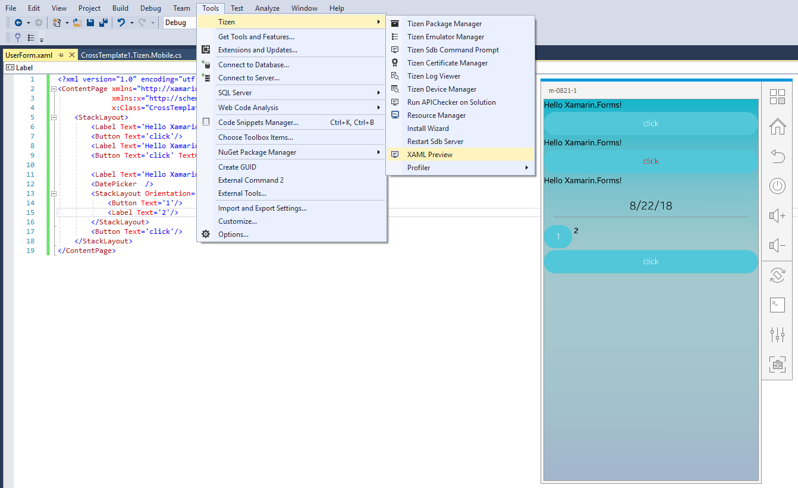

## XAML Previewer ##

The previewer application represents a Xamarin.Forms app, which runs on Tizen emulator and dynamically loads fragments of XAML code from Visual Studio to show some preview of GUI layout to developer.
Solution represents a Visual Studio plugin and Xamarin.Forms application. VS plugin makes minimal local preprocessing of XAML code and sends it to Previewer application that runs on Tizen emulator. Previewer application parses incoming XAML page in runtime and renders it. VS plugin has also functionality to deploy and run Previewer application on emulator.



## Building and Installation ##
### Build previewer application from sources ###

* Get sources:

```shell
nick@nick-PC MINGW64 /d/git  
$ cd temp/  
$ git clone  https://git-s.dev.rtsoft.ru/tizen-tools/xaml-previewer.git  
$ ls -l xaml-previewer/  
total 4  
drwxr-xr-x 1 nick 197121 0 апр  3 21:01 Parser_C_Sharp/  
drwxr-xr-x 1 nick 197121 0 апр  3 21:01 Parser_F_Sharp/  
drwxr-xr-x 1 nick 197121 0 апр  3 21:01 Previewer/  
drwxr-xr-x 1 nick 197121 0 апр  3 21:01 SDBHelper/  
```

Note: Previewer application solution is located under `Previewer/` folder

* Open previewer application solution in Visual Studio and build it. Building requires VS Tools for Tizen plugin.



* After successfull build you get tpk package that is located under `Previewer\XamlPreviewer\XamlPreviewer.Tizen.Mobile\bin\Debug\tizen50` folder. Then you should manually put previewer tpk package under Tizen `SDK/tools/previewer` folder.
After first previewer launch from MS VS plugin will automatically install it to the current running emulator. (see usage section of this document).

### Build MS VS plugin from sources ###

* Get sources and checkout to release branch:

```shell  
$ git clone https://git-s.dev.rtsoft.ru/tizen-tools/vs-tools-cps.git  
$ git checkout release  
```

* Open plugin solution in Visual Studio and build it.



## Usage ##

1. Start MS VS with installed VS Tools for Tizen plugin
2. Start Tizen emulator
3. Open your Xamarin.Forms project
4. Open Solution Explorer
5. Click `Right Mouse` button on the project, then click `Add->New Item...`

    

6. Select `Text File` and enter name with extension of `.xaml`

    

7. Click `OK`
8. Copy and past the next code listing to the created xaml file and save it

    ```xml
<?xml version="1.0" encoding="utf-8" ?>
<ContentPage xmlns="http://xamarin.com/schemas/2014/forms"
             xmlns:x="http://schemas.microsoft.com/winfx/2009/xaml"
             x:Class="CrossTemplate1.ComplexPage">
    <StackLayout>
        <Label Text='Hello Xamarin.Forms!' />
        <Button Text='click'/>
        <Label Text='Hello Xamarin.Forms!' />
        <Button Text='click' TextColor='Red'/>

        <Label Text='Hello Xamarin.Forms!' />
        <DatePicker  />
        <StackLayout Orientation='Horizontal'>
            <Button Text='1'/>
            <Label Text='2'/>
        </StackLayout>
        <Button Text='click'/>
    </StackLayout>
</ContentPage>
```

9. Click `Tools->Tizen->XAML Preview`
10. If previewer application is not installed on current emulator, it will be automatically installed

    

11. After installation it will run automatically and dynamically show your XAML page layout

    

12. Make some changes in your XAML code, click menu button again and emulator will update layout


## Current restrictions ##

1.	XAML code should contain Page as the base element of presentation (ContentPage, Tabbed Page, .. etc)
2.	Nested XAML files are not supported
3.	XAML Binding feature is not supported
4.	References to external resources in XAML are not supported
